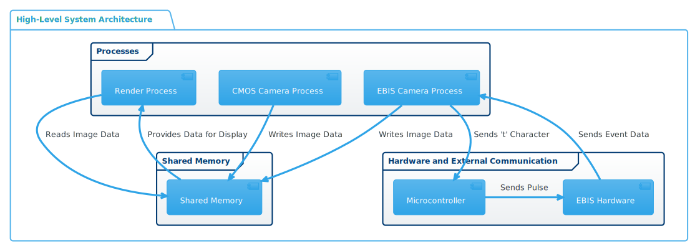

# System Manual for Camera Synchronization and Visualization Tool

### Overview

This manual provides a comprehensive guide for maintaining and updating the camera synchronization and visualization tool, integrating an AmScope MU130 CMOS camera with a Prophesee EVK Gen 3.0 VGA HD event camera. The tool captures and processes data from both cameras concurrently, displays it in real time, and ensures synchronization for post-processing.

### Purpose and Use Case

The tool is developed for applications requiring synchronized operation of traditional and event-based imaging systems, particularly useful in research, motion analysis, and environments demanding precise temporal analysis of visual data. It enables real-time visualization, camera control, data processing, and synchronization via a microcontroller.

### System Architecture

#### Hardware Components

1. **AmScope MU130 CMOS Camera:** Captures standard image frames.
2. **Prophesee EVK Gen 3.0 VGA HD Event Camera:** Captures data based on scene changes.
3. **Microcontroller:** Sends a digital pulse for synchronization.
4. **Computing Platform:** Runs the Python-based software for data processing and visualization.

#### Software Components

1. **AmScope Python SDK:** Interfaces with the CMOS camera.
2. **Prophesee SDK (metavision\_hal, metavision\_core):** Manages the event camera.
3. **Pygame:** Used for real-time image display.
4. **OpenCV (cv2):** Handles image processing.
5. **Python Multiprocessing:** Manages parallel data capture and processing.

#### Data Flow

1. **Image Capture:**
   * CMOS and event cameras capture data simultaneously.
   * Data is stored in shared memory for efficient access.
2. **Processing and Display:**
   * The rendering process reads data from shared memory, converts it to a display-friendly format, and updates a Pygame window in real time.
3. **User Interaction:**
   * Responds to keypresses: \[SPACE] to toggle recording, \[ESC], or \[q] to exit.
4. **Synchronization:**
   * The trigger function sends a 't' character to the microcontroller via serial communication.
   * The microcontroller sends a 3.3V pulse on pin C7 to the event camera's trigger-in channel for synchronization.
5. **Recording:**
   * Recording for both cameras is initiated by pressing \[SPACE].
   * Synchronization pulses are injected into the event camera's data stream as timestamps.

### &#x20;Multiprocessing

### Maintenance and Updates

The multi-process architecture was chosen due to the CPU-bound nature of the event camera's recording algorithm, which is tied to the Metavision SDK and cannot be altered. Initially, the logic was implemented in separate threads, but this led to issues due to Python's Global Interpreter Lock (GIL), affecting synchronization and performance. Symptoms of this issue included inconsistent trigger pulses, slow rendering times, and dropped frames.

#### Key Areas for Maintenance

1. **Camera SDK Updates:** Regularly check compatibility with the latest camera SDKs.
2. **Microcontroller Firmware:** Update and configure the firmware, especially the trigger pulse pin.
3. **Pygame and OpenCV Libraries:** Keep these libraries updated for display and image processing functionalities.

#### Adding New Features or Updates

1. **Modifying Camera Parameters:** Adjust settings in `setup_camera()` and `setup_ebis()` functions.
2. **Changing Display Layout:** Update `render()` to alter visualization in Pygame.
3. **Updating Synchronization Logic:** Modify `create_trigger_with_timer()` and corresponding microcontroller code for changes in synchronization behavior.
4. **Enhancing Data Processing:** Introduce new image processing routines in `store_image()`.

#### Testing and Validation

* Test the system for correct image capture and display, synchronization accuracy, stability, and performance after any update.

#### Troubleshooting Common Issues

* **Camera Connection Failures:** Verify SDK installations, and check physical connections and camera settings.
* **Synchronization Errors:** Ensure correct microcontroller setup, including pin configuration for pulse generation.
* **Display Issues:** Check Pygame window initialization and frame update logic in `render()`.
* **Performance and Stability Concerns:** If symptoms like poorly synchronized events, inconsistent pulse triggers, slow frame rendering, or crashes occur, investigate potential process thread locking issues, reminiscent of the challenges encountered with Python's Global Interpreter Lock (GIL) in earlier threading-based implementations.

### Conclusion

Maintaining and updating this system requires understanding its architecture, components, and the developmental history behind certain design choices, particularly the shift from a threading to a multi-process approach. Any future modifications should be evaluated in this context to maintain the system's integrity and performance.

### Diagram

<figure><figcaption></figcaption></figure>
