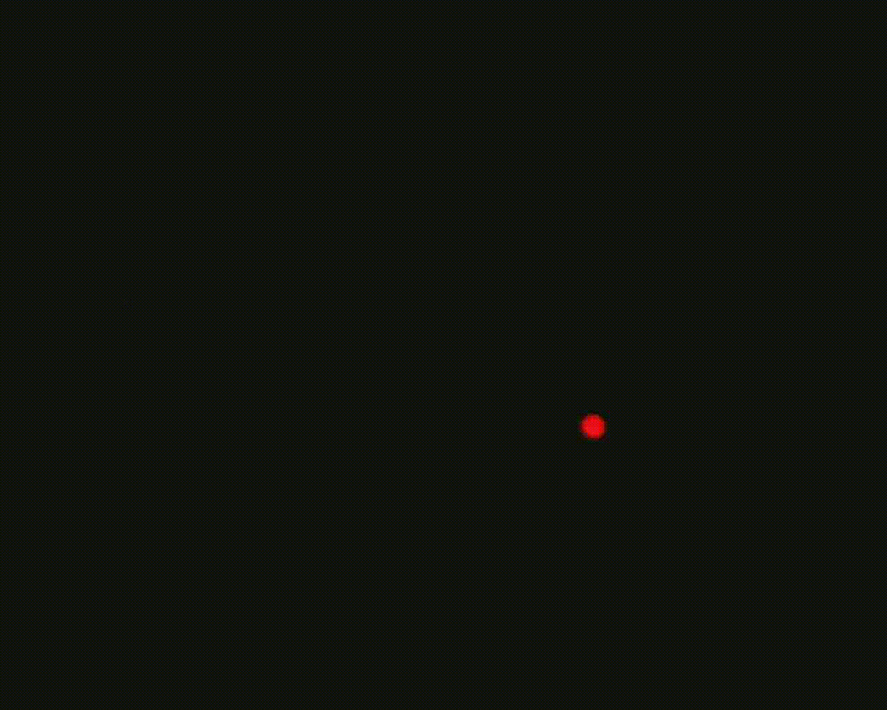

# Characterizing parameter effects on EBIS output

### Key Points:

* **Objective**: Understanding the impact of various setup variables on an Event Based Image Sensor (EBIS).
* **Variables Tested**: Tuning parameters, laser power, motor usage, and ground glass diffuser.
* **Method**: Controlled experiments with fluorescent beads and different setup configurations.
* **Major Findings**:
  * Exponential relationship between event count and on/off threshold settings.
  * Influence of laser power on EBIS output and beam speckle.
  * Motor's impact on EBIS output.
  * Effectiveness of ground glass diffuser in beam speckle reduction.
* **Optimal Setup**: No motor with diffuser combination.
* **Improvements**: Implementation of a 90:10 splitter and adjustments in mirror alignment and magnification.

### Introduction:

This report details a series of experiments conducted to understand the impact of various variables on the output of an Event Based Image Sensor (EBIS). Using a controlled experimental setup involving fluorescent beads, the effects of tuning parameters, laser power, motor, and ground glass diffuser on the EBIS were meticulously investigated. The aim was to optimize the EBIS setup for enhanced performance and clarity.

### Experiments:

1. **Tuning Parameters**:
   * Method: Incremental adjustment of on-event thresholds while focusing on a fluorescent bead.
   * Observation: Exponential relationship between event count and threshold settings.
2. **Laser Power**:
   * Method: Varying laser power in 4mw steps, comparing EBIS output with CMOS readings.
   * Observation: Correlation between laser power and average intensity in EBIS and beam speckle in CMOS.
3. **Motor**:
   * Method: Assessing motor's effect on EBIS output using a silver slide and emission filter removal.
   * Observation: Detectable influence of motor-induced motion on EBIS.
4. **Ground Glass Diffuser**:
   * Method: Repeating motor experiment with a diffuser to analyze its effect on beam speckle.
   * Observation: Motor and diffuser combinations impact on EBIS and CMOS outputs.
5. **Comprehensive Characterization**:
   * Method: Testing motor/diffuser permutations on moving and static beads, recording EBIS and CMOS outputs.
   * Observation: Detailed characterization of motor and diffuser's effect on setup.

### Results:

The experiments revealed that the most effective setup for EBIS involves using no motor in conjunction with a diffuser. This setup minimized the issues related to beam speckle and event spike at the frame's edge. Further improvements, including a 90:10 beam splitter and alignment adjustments, yielded clearer results and minimized distortion when beads lost focus.

### Discussion:

The findings from these experiments are critical for enhancing EBIS performance. The exponential relationship between event count and threshold settings underscores the need for precise tuning of EBIS parameters. The motor, while useful for reducing beam speckle, was found to negatively impact the EBIS output, an issue resolved by the ground glass diffuser. The final setup adjustments, particularly the splitter ratio change and optical alignment, significantly improved the quality of the sensor's output.

### Figures

1.

    <figure><figcaption></figcaption></figure>
2.

    <figure><figcaption></figcaption></figure>
3.

    <figure><figcaption></figcaption></figure>

4.

    <figure><figcaption></figcaption></figure>

5.

    <figure><figcaption></figcaption></figure>

6.

    <figure><figcaption></figcaption></figure>

7.

    <figure><figcaption></figcaption></figure>
8.

    <figure><figcaption></figcaption></figure>

9.

    <figure><figcaption></figcaption></figure>

10.

    <figure><figcaption></figcaption></figure>

11.

    <figure><figcaption></figcaption></figure>

12.

    <figure><figcaption>
As captured by the CMOS
</figcaption></figure>

13.

    <figure><figcaption></figcaption></figure>

14.

    <figure><figcaption></figcaption></figure>

15.

    <figure><figcaption>
As seen by the CMOS
</figcaption></figure>
16.

    <figure><figcaption></figcaption></figure>

17.

    <figure><figcaption></figcaption></figure>

18.

    <figure><figcaption>
As seen by the CMOS
</figcaption></figure>
19.

    <figure><figcaption></figcaption></figure>

20.

    <figure><figcaption></figcaption></figure>
21.

    <figure><figcaption>
As seen by the CMOS
</figcaption></figure>

22.

    <figure><figcaption>
With 90:10 splitter and corrected magnification
</figcaption></figure>

23.

    <figure><figcaption></figcaption></figure>

24.

    <figure><figcaption>
As seen by the CMOS (Due to exposure time requirements of the CMOS, nothing is visible until the bead stops moving)
</figcaption></figure>
