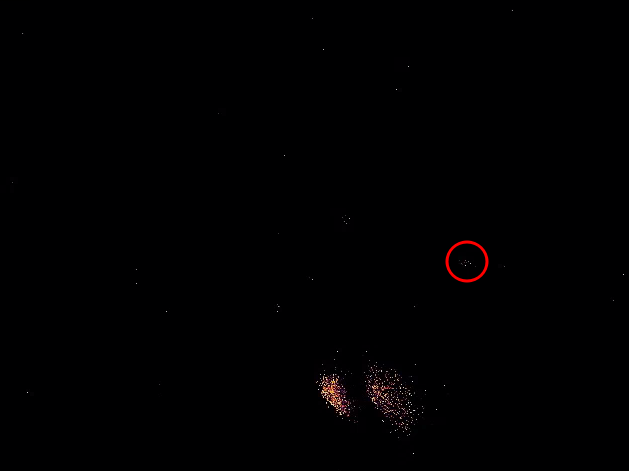

# Characterizing Sensor Response and Fluorophore Blinking

### Key Points:

* **Objective**: To differentiate sensor response to motion, intrinsic blinking of fluorophores, and assess despeckling's impact.
* **Methodology**: Conducted three separate experiments involving a tightly focused laser, fluorophore motion characterization, and intrinsic blinking analysis.
* **Results**: Varied responses observed in each experiment, highlighting the sensor's behavior under different conditions.
* **Conclusion**: Despeckling motor impacts event detection and noise levels; accurate fluorophore blinking detection requires specific conditions.

### Introduction:

This report presents a detailed analysis of three distinct experiments designed to understand the sensor's response to motion, intrinsic blinking of fluorophores, and the effect of despeckling on sensor output. These experiments are crucial for comprehending sensor dynamics in varied imaging scenarios.

### Methodology:

#### Experiment 1: Laser Focus and Despeckling Motor Impact

1. **Setup**: A laser was tightly focused on a silver slide, with emission filter and dichroic mirror removed. ([Fig 1, 2](characterizing-sensor-response-and-fluorophore-blinking.md#figures))
2. **Data Recording**: Captured event data with the despeckling motor both on and off. ([Fig 7, 8](characterizing-sensor-response-and-fluorophore-blinking.md#figures))

#### Experiment 2: Fluorophore Motion Characterization

1. **Laser Adjustment**: Defocused the laser to fill the entire field of view (FOV) ([Fig 3 - 5](characterizing-sensor-response-and-fluorophore-blinking.md#figures)).
2. **Sample Preparation**: Placed a dilute sample of 625nm fluorophore on a coverslip, allowed to dry.
3. **Measurement**: Used Full Width at Half Power (FWHP) method for size measurement ([Fig 9, 10](characterizing-sensor-response-and-fluorophore-blinking.md#figures)).
4. **Oscillation and Capture**: Oscillated the bead across the field of view, recording event responses with and without the despeckling motor ([Fig 11 - 14](characterizing-sensor-response-and-fluorophore-blinking.md#figures))
5. **Post Processing**: Events were processed using the time surface algorithm, chosen for its high temporal and spatial resolution.

#### Experiment 3: Intrinsic Blinking of Fluorophores

1. **Setup**: A bead was placed within the FOV, confirmed by both the CMOS output, and the output of the EBIS when light vibrations were induced.
2. **Recording**: Focused on a bead within the FOV, recording outputs without external motion, with and without the despeckling motor.

### Results:

#### Experiment 1: Laser Focus and Despeckling Motor Impact

* Observed a significant increase in events with the despeckling motor on. ([Fig 7](characterizing-sensor-response-and-fluorophore-blinking.md#figures))
* Notable events from the laser in both focused and defocused states, irrespective of the motor’s status. ([Fig 8](characterizing-sensor-response-and-fluorophore-blinking.md#figures))

#### Experiment 2: Fluorophore Motion Characterization

* Physical size of fluorophores measured at approximately 3um in diameter using FWHP.
* Event sensor output measured the fluorophore at approximately 2.5um, indicating a 0.5um discrepancy within acceptable error margin.
* Minimal effect of motor motion on perceived object size, but increased noise observed when motor was enabled. ([Fig 11, 12](characterizing-sensor-response-and-fluorophore-blinking.md#figures))
* Bead was significantly more difficult to identify likely due to the algorithm chosen.

#### Experiment 3: Intrinsic Blinking of Fluorophores

* Intrinsic blinking of fluorophores was indistinguishable from background noise.
* When the laser was defocused to fill the entire FOV, the fluorophore's blinking was not clearly detectable, with or without the despeckling motor. ([Fig 15 - 18](characterizing-sensor-response-and-fluorophore-blinking.md#figures))
* This is in contrast to the output of the same experiment when the laser was focused to a 100um spot size. ([Fig 19, 20](characterizing-sensor-response-and-fluorophore-blinking.md#figures))

### Discussion:

#### Experiment 1: Laser Focus and Despeckling Motor Impact

The increase in events with the despeckling motor suggests that the motor introduces additional variables affecting event detection. This finding is crucial for sensor calibration in precision tasks.

#### Experiment 2: Fluorophore Motion Characterization

The findings indicate that there is limited affect on the perceived object size with or without the motor, particularly when the laser is defocused. There is, however, a discernible increase in noise with the motor on as compared to no motor. This increase in noise makes if significantly more dificult to identify a single fluorophore in the FOV of the EBIS. The time surface of the oscilating motion with the motor makes this clear. At each x,y coordinate the most recent time stamp of an event is stored and then allowed to decay over time. This means that for noisy signals, the last captured event is very often noise and any signal is lost ([Fig 14](characterizing-sensor-response-and-fluorophore-blinking.md#figures))

#### Experiment 3: Intrinsic Blinking of Fluorophores

The inability to distinguish the fluorophore's blinking from background noise underlines the need for controlled lighting conditions ([Fig 17 - 18](characterizing-sensor-response-and-fluorophore-blinking.md#figures)). This experiment suggests that further investigation is required to determine the intrinsic blinking of the fluorescent sample. An increased light intensity or improved uniformity, as well as careful tuning of the EBIS may all be required to accurately perform this experiment. Furthermore, the fact that the blinking was detectable when the beam was focused ([Fig 19, 20](characterizing-sensor-response-and-fluorophore-blinking.md#figures)) suggests that the laser intensity may be the most critical factor in observing the desired behavior.

### Conclusion:

The three experiments collectively demonstrate the sensor's varied responses under different conditions. The despeckling motor, while aiding in event detection, introduces additional noise, complicating data interpretation. Accurate detection of fluorophore blinking requires specific experimental setups, particularly in terms of lighting. Future research should focus on optimizing these conditions to enhance sensor accuracy and reliability in diverse imaging applications.

### Figures:

1.

    <figure><figcaption>
Tightly focused beam without motor
</figcaption></figure>

2.

    <figure><figcaption>
Tightly focused beam with motor
</figcaption></figure>

3.

    <figure><figcaption>
Defocused beam with motor
</figcaption></figure>

4.

    <figure><figcaption>
Defocused beam intensity distribution
</figcaption></figure>

5.

    <figure><figcaption>
Defocused beam without motor
</figcaption></figure>

6.

    <figure><figcaption>
Defocused intensity distribution. Largest dark area measured approx. 8um.
</figcaption></figure>

7.

    <figure><figcaption>
Events/2ms temporal bin with motor
</figcaption></figure>

8.

    <figure><figcaption>
Events/2ms temporal bin without motor
</figcaption></figure>

9.

    <figure><figcaption>
625nm fluorophore
</figcaption></figure>

10.

    <figure><figcaption>
FWHP measurment of fluorophore
</figcaption></figure>

11.

    <figure><figcaption>
Oscilating bead time surface no motor
</figcaption></figure>

12.

    <figure><figcaption>
Oscilating bead time surface with motor
</figcaption></figure>

13.

    <figure><figcaption>
Time surface of a single bead - no motor
</figcaption></figure>

14.

    <figure><figcaption>
Time surface of a single bead - w motor
</figcaption></figure>
15.

    <figure><figcaption>
Intrinsic blinking time series - no motor
</figcaption></figure>

16.

    <figure><figcaption>
Intrinsic blinking time series - with motor
</figcaption></figure>

17.

    <figure><figcaption>
Intrinsic blinking time surface - no motor
</figcaption></figure>

18.

    <figure><figcaption>
Intrinsic blinking time sruface - with motor
</figcaption></figure>

19.

    <figure><figcaption>
Intrinsic blinking time surface - with motor and focused beam
</figcaption></figure>

20.

    <figure><figcaption>
Intrinsic blinking time surface - with motor and focused beam
</figcaption></figure>

