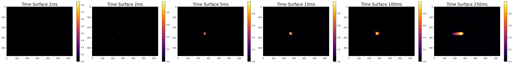

# Comparative Analysis of Event-Driven Sensor Data Visualization

### **Introduction**

This report presents a comparative analysis of our findings against those in a referenced paper, focusing on the visualization techniques used to interpret event-driven sensor data. The basis of both studies is a time surface algorithm that generates an x,y,t hypercube from sensor events.

### **Fig 1: Time Surface Plot**

* **Methodology**: Utilized the manufacturer's API to generate a time surface cube from 1s of events, split into 2ms surfaces.
* **Objective**: Visualize the motion of a single fluorescent bead moving in the x-direction.
* **Comparison**: Establishes the foundational methodology for subsequent figures and comparisons. The two results are similar.

<figure><figcaption>
Time surface plot. 1 slice of 2ms data
</figcaption></figure>

<figure><figcaption>
Time surface plot from referenced paper
</figcaption></figure>

### **Fig 2: x,y,t Cube for a Single Surface**

* **Visualization**: Separated positive and negative events, plotted in a 3D coordinate system (x,y coordinates on x,z plane and t coordinates on the y plane).
* **Key Feature**: The blue box represents a static frame in time.
* **Comparison**: Closely aligns with the counterpart figure from the referenced paper.

<figure><figcaption>
x, y, t cube
</figcaption></figure>

<figure><figcaption>
Reference x,y,t cube
</figcaption></figure>

### **Fig 3: x,y,t as a Stacked Plot**

* **Approach**: Implemented a clustering algorithm to calculate weighted centroids for each event cluster.
* **Challenges**: Addressed the translation of event data into object representation (bead motion) and noted susceptibility to noise as demonstrated by the non-uniformity of the first several events.
* **Comparison**: Demonstrates methodological differences and interpretative challenges compared to the referenced paper. The result is similar, however it cannot be known whether this is the methodology used by the paper.

<figure><figcaption>
x,y,t stacked chart
</figcaption></figure>

<figure><figcaption>
comparison stacked chart
</figcaption></figure>

### **Fig 4: x,y,t Color Plot**

* **Visualization**: Extended the approach from Fig 3 with a full-scale representation of y-axis (0-480px) and time as the primary axis.
* **Observations**: Highlighted the impact of noise and nonuniform event clustering on centroid calculations, especially visible at small y scales.
* **Comparison**: Provides insights into the nuances of data interpretation and the limitations of the chosen methodology, in contrast to the referenced paper. Here motion is represented by a series of points plotted in succession, and time is represented by color. In the comparison paper time is not represented and motion is represented by a blurring effect applied to object.

<figure><figcaption>
x, y, t color plot
</figcaption></figure>

<figure><figcaption>
comparison x,y,t color plot
</figcaption></figure>

### Fig 5: x,y,t Color Plot in Time Steps

* **Approach:** Create a time surface in the same manner as above ([Fig 1.](comparative-analysis-of-event-driven-sensor-data-visualization.md#fig-1-time-surface-plot)) using different sized temporal bins.
* **Observations:** The time surface accurately depicts the trajectory of the bead and provides the same "blurring" effect as its counterpart from the paper, however, the paper depicts individual beads whereas these time surfaces depict the events themselves.

<figure><figcaption></figcaption></figure>

<figure><figcaption></figcaption></figure>

### **Conclusion**

* **Findings**: The analysis demonstrates a close alignment in methodology but also underscores the challenges in interpreting event-driven data, particularly in correlating events to object movements.
* **Implications**: The comparison highlights the importance of considering noise and event clustering patterns in visualizing and interpreting sensor data.
