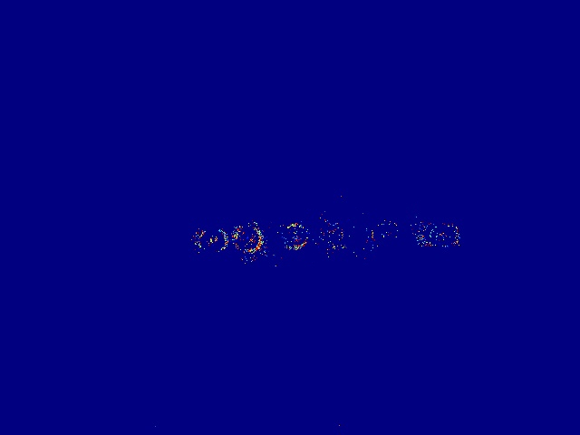
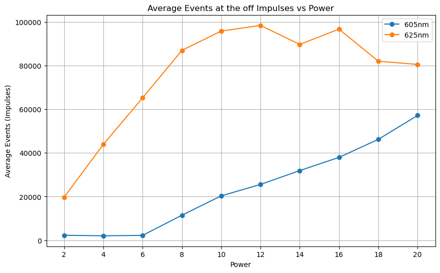

# High-Speed 2D Imaging with Event Cameras: Replication and Analysis of EventLFM paper by Ruipeng Guo

### Introduction

An attempt at replicating the results of [EventLFM](../works-cited/eventlfm-event-camera-integrated-fourier-light-field-microscopy-for-ultrafast-3d-imaging.md), a paper by Ruipeng Guo. Please be aware that the referenced paper has figures which are reconstructions based on the output from the event sensor, not the event data itself. This is not the case in these results.

### Key Points

1. Replication of experiments using an event camera in a 2D space, focusing on high-speed imaging.
2. Successful recreation of a fluorescent bead moving along the x-axis and stationary blinking fluorophore experiments.
3. Generation of time surface plots at 10,000 fps with an accumulation time of 2ms.
4. Linearity plot showcasing the relationship between intensity and excitation power.
5. Unsuccessful attempt to replicate the Brownian motion experiment from the original study.

### Experimental Setup

1. **Fluorescent Bead Movement Experiment**:
   * Setup involved moving a fluorescent bead along the x-axis.
   * Time surface plots were generated at 10,000 fps, with an accumulation time set to 2ms.
2. **Blinking Stationary Fluorophore Experiment**:
   * Experiment involved observing a stationary fluorophore undergoing blinking.
   * Time surface plots created under the same conditions as the bead movement experiment.
3. **Intensity vs. Excitation Power Experiment**:
   * A controlled setup to vary the excitation power and measure the resulting fluorescence intensity.
   * Data collected to establish a linearity relationship.

### Results

The experiments yielded distinct outcomes. For the fluorescent bead movement, the time surface plots vividly illustrated the bead's trajectory along the x-axis, affirming the camera's high temporal resolution capabilities (refer to Figure 1). Similarly, in the blinking stationary fluorophore experiment, the time surface plots effectively captured the on-off blinking pattern of the fluorophore (refer to Figure 2). The linearity experiment demonstrated a clear linear relationship between the fluorescence intensity and the excitation power (refer to Figure 3), mirroring the findings in the original study. However, the attempt to replicate the Brownian motion experiment was not successful, and no comparable data was produced.

It should be noted that many of the results in the reference paper are reconstructions based on the output of these plots. What is depicted here are the plots themselves.

### Discussion

The replicated experiments reinforce the efficacy of the event camera in capturing high-speed, dynamic processes in 2D space. The linearity of intensity with excitation power (Figure 3) is particularly significant as it validates the camera's sensitivity and quantitative measurement capabilities. The unsuccessful replication of the Brownian motion experiment suggests a possible divergence in experimental conditions or limitations in the current setup. Future steps include a detailed review of the Brownian motion experimental protocol, considering factors like particle size, medium viscosity, and camera settings. Investigating the data processing techniques and exploring alternative approaches might also provide insights into achieving successful replication.

#### Figures:

1. **Figure 1:** Time Surface Plot of Fluorescent Bead Movement - Illustrating the bead's trajectory along the x-axis.

<figure><figcaption>
10k FPS (Warmer colors represents more recent events)
</figcaption></figure>

2. **Figure 2:** Time Surface Plot of Blinking Stationary Fluorophore - Capturing the on-off blinking pattern.

<figure><figcaption>
10k FPS
</figcaption></figure>

3. **Figure 3:** Linearity Plot of Intensity vs. Excitation Power - Demonstrating the linear relationship between fluorescence intensity and excitation power.

<figure><figcaption></figcaption></figure>

